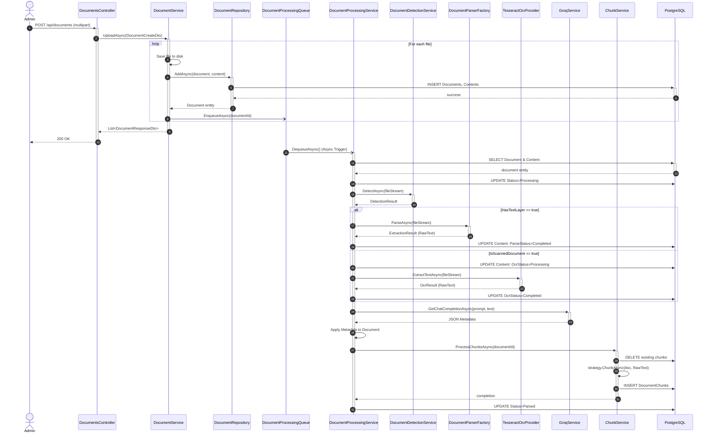
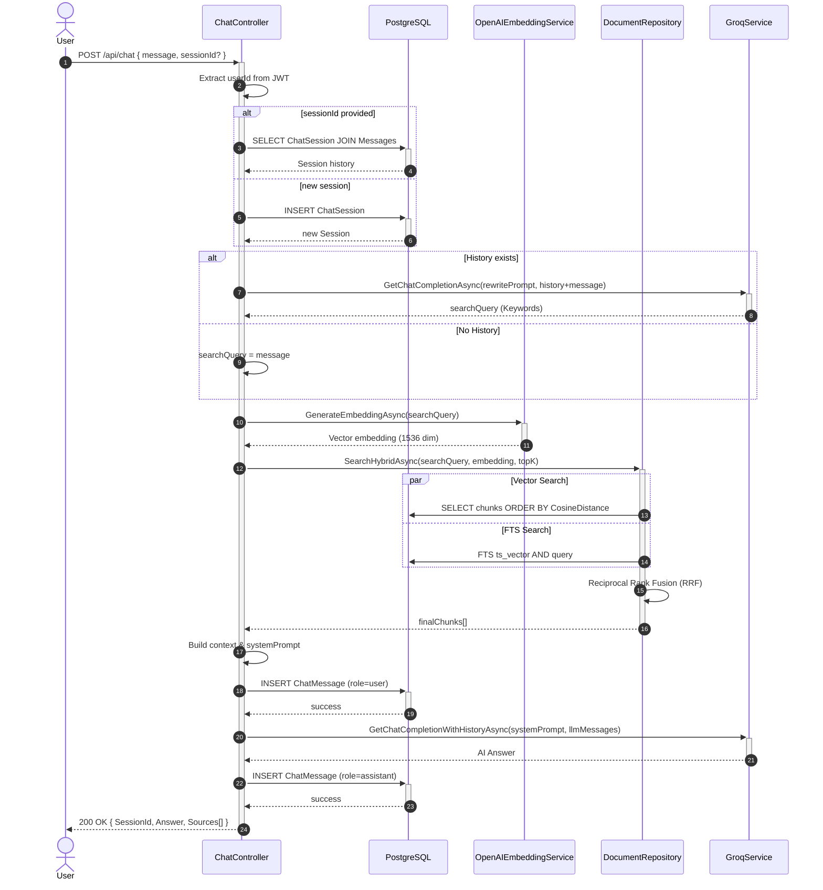
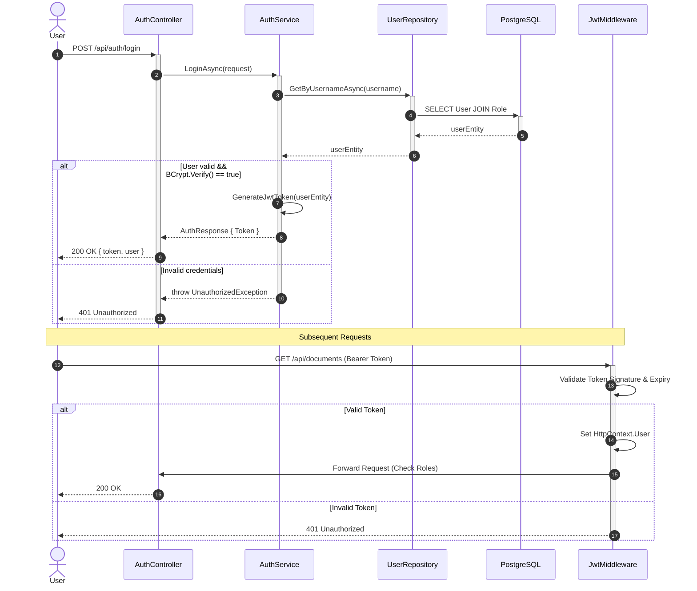
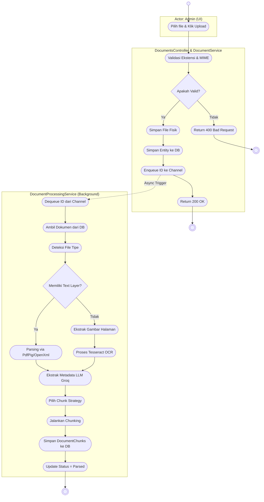
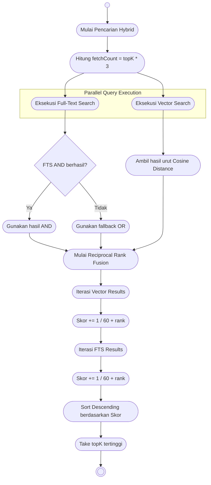
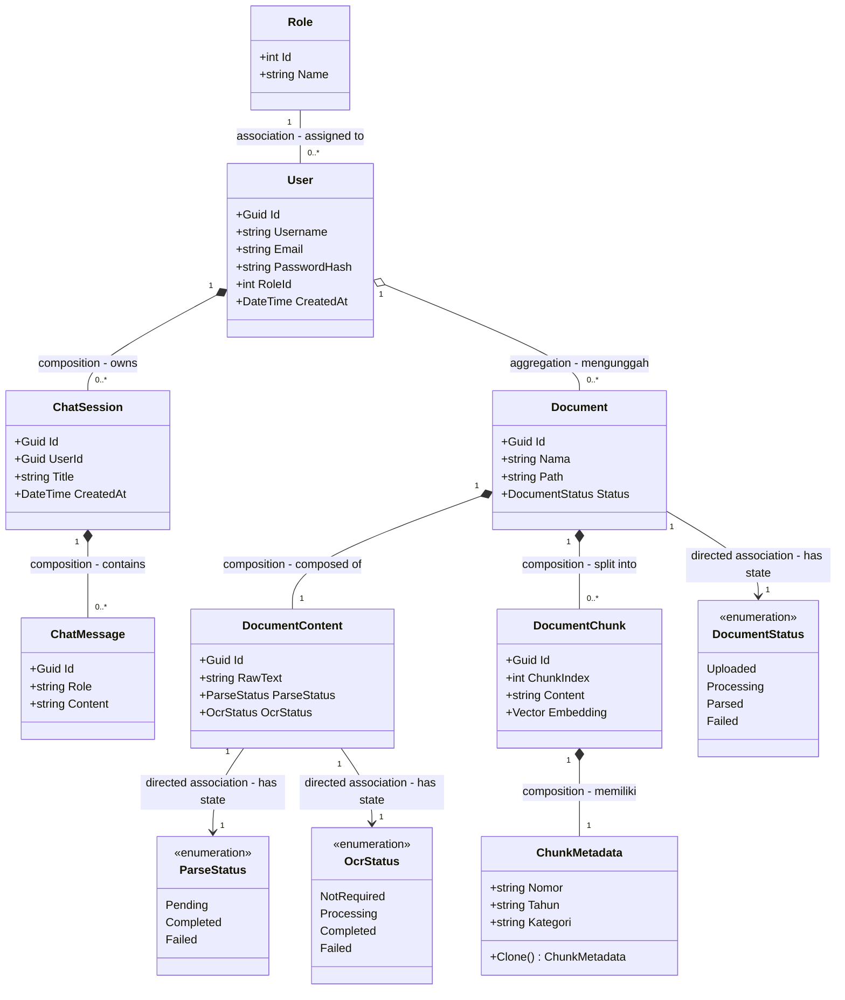
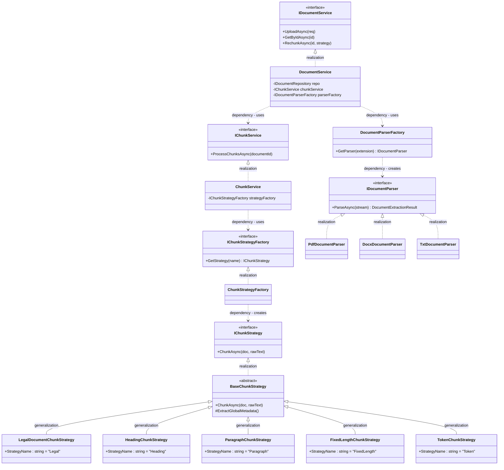
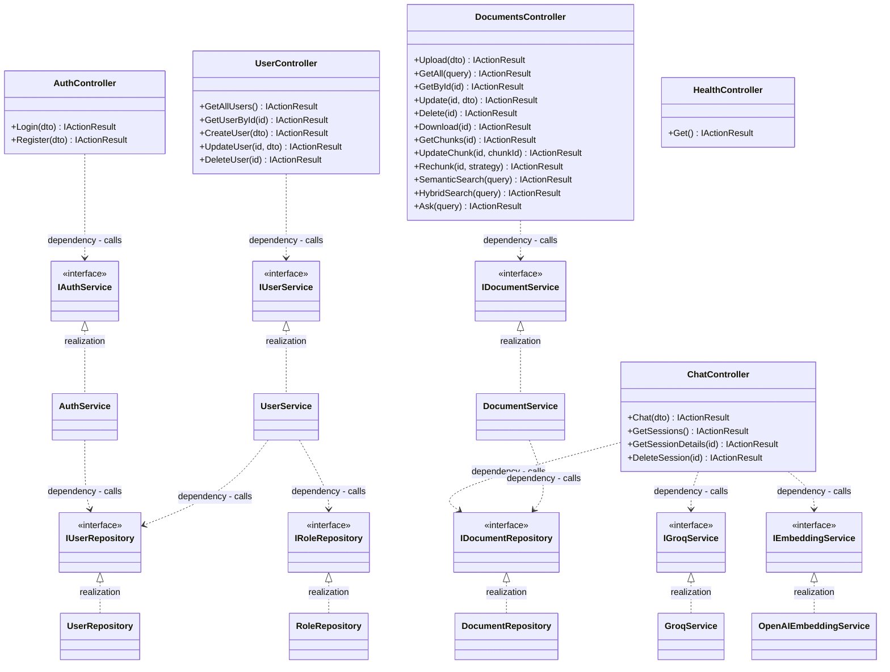
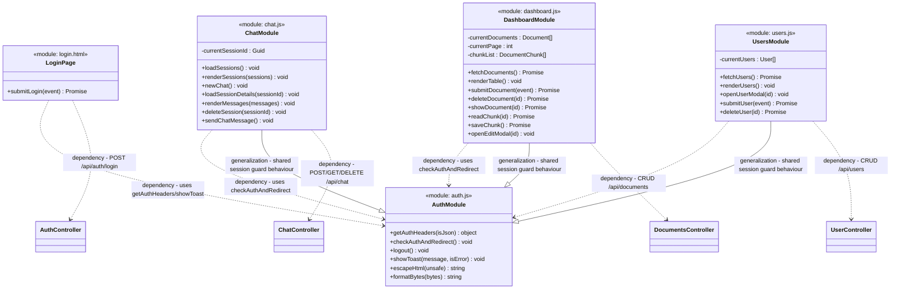
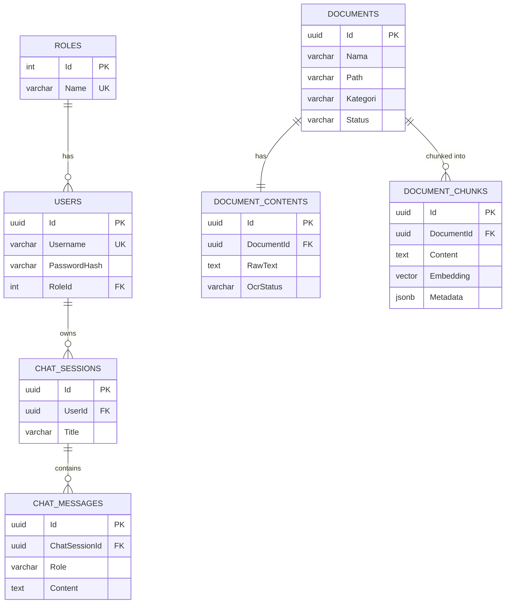

# SIAP — Sistem Informasi Analisis Peraturan
## Dokumentasi Teknis Lengkap · Arsitektur, Diagram, dan Referensi API

> **Diperbarui otomatis dari analisis kode sumber + Graphify knowledge graph**  
> Stack: **ASP.NET Core 10** · **PostgreSQL + pgvector** · **Tesseract OCR** · **Groq LLM API** · **OpenAI Embeddings** · **Docker**

---

## Daftar Isi

1. [Gambaran Umum](#1-gambaran-umum)
2. [Struktur Proyek](#2-struktur-proyek)
3. [Arsitektur Sistem](#3-arsitektur-sistem)
4. [Alur Proses Utama](#4-alur-proses-utama)
5. [UML Sequence Diagram](#5-uml-sequence-diagram)
6. [UML Activity Diagram (Swimlane)](#6-uml-activity-diagram-swimlane)
7. [UML Activity Diagram (Sistem)](#7-uml-activity-diagram-sistem)
8. [UML Class Diagram](#8-uml-class-diagram) *(Domain Entities, Service/Strategy/Parser, Layered Backend, Frontend)*
9. [UML Entity Relationship Diagram (ERD)](#9-uml-entity-relationship-diagram-erd)
10. [UML Use Case Diagram](#10-uml-use-case-diagram)
11. [Komponen Teknis Penting](#11-komponen-teknis-penting)
12. [Konfigurasi dan Environment](#12-konfigurasi-dan-environment)
13. [Referensi Endpoint API](#13-referensi-endpoint-api)
14. [Infrastruktur dan Deployment](#14-infrastruktur-dan-deployment)

---

## 1. Gambaran Umum

**SIAP** adalah sistem backend REST API untuk **manajemen dan analisis dokumen peraturan hukum** (Undang-Undang, Peraturan Daerah, Peraturan Pemerintah, dll.). Sistem ini dilengkapi pipeline AI end-to-end mulai dari upload file hingga tanya-jawab cerdas berbasis dokumen.

| Fitur | Teknologi |
|---|---|
| Upload & simpan file (PDF / DOCX / TXT / Image) | ASP.NET Core, File System |
| Deteksi tipe dokumen (text-layer vs scan) | PdfPig detection |
| OCR dokumen scan / gambar | Tesseract CLI (ind+eng) |
| Parsing teks terstruktur | PdfPig, OpenXml, TxtParser |
| Chunking cerdas 5 strategi | Legal, Heading, Paragraph, FixedLength, Token |
| Ekstraksi metadata otomatis via LLM | Groq API (Mixtral) |
| Pencarian Full-Text (FTS) | PostgreSQL `ts_vector` (bahasa Indonesia) |
| Pencarian Semantik (Vector Search) | pgvector + OpenAI `text-embedding-3-small` |
| **Pencarian Hybrid (FTS + Vector + RRF)** | Reciprocal Rank Fusion (k=60) |
| **Query Rewriting via LLM** | Groq API (sebelum retrieval di Chat) |
| Tanya-Jawab berbasis dokumen (RAG) | Groq + dokumen konteks |
| Chat session dengan riwayat percakapan | PostgreSQL + Groq API |
| Manajemen pengguna & role | JWT (HS256), BCrypt |

---

## 2. Struktur Proyek

```text
SIAP/                                    <- Root proyek ASP.NET Core 10
|
+-- Program.cs                           <- Entry point: DI registration, middleware pipeline
+-- SIAP.Api.csproj                      <- Project file & NuGet dependencies
+-- appsettings.json                     <- Konfigurasi (Serilog, ChunkOptions, OCR, JWT)
+-- .env                                 <- Secret keys (ApiKey, DB connection string)
|
+-- Controllers/                         <- HTTP entry points (Routing & Request handling)
+-- Services/                            <- Business logic layer (Implementations & Interfaces)
+-- Repositories/                        <- Data access layer (EF Core)
+-- Data/                                <- DbContext & Migrations
+-- Entities/                            <- Domain models
+-- DTOs/                                <- Data Transfer Objects
+-- Configurations/                      <- Options pattern
+-- Middleware/                          <- Custom middleware
+-- Common/                              <- Helpers & Wrappers
+-- page/backup/                         <- Frontend Mockup (HTML/JS)
```

---

## 3. Arsitektur Sistem

```text
+----------------------------------------------------------------+
|              CLIENT / BROWSER (UI: page/backup)                |
|         (dashboard.js, chat.js, users.js, auth.js)             |
+---------------------------+------------------------------------+
                            | HTTP/HTTPS
+---------------------------v------------------------------------+
|                   MIDDLEWARE PIPELINE                          |
| CORS -> RequestLoggingMiddleware -> GlobalExceptionMiddleware  |
| -> UseAuthentication (JWT) -> UseAuthorization -> Controllers  |
+----------+---------------+---------------+---------------------+
| AuthCtrl | DocumentsCtrl |   ChatCtrl    | UserCtrl/HealthCtrl |
+----------+---------------+---------------+---------------------+
|                      SERVICE LAYER                             |
| AuthService | DocumentService | UserService | GroqService      |
| OpenAIEmbeddingService | TesseractOcrProvider                  |
| DocumentDetectionService | DocumentProcessingQueue             |
| Parsers: Pdf/Docx/Txt    ChunkService + 5 Strategies           |
| DocumentProcessingService (BackgroundService / HostedService)  |
+----------------------------------------------------------------+
|                    REPOSITORY LAYER                            |
| DocumentRepository | UserRepository | RoleRepository           |
| (Entity Framework Core + Npgsql + Pgvector)                    |
+----------------------------------------------------------------+
|           PostgreSQL 16 + pgvector extension                   |
+----------------------------------------------------------------+
```

---

## 4. Alur Proses Utama

1. **Upload Dokumen**: Client mengunggah file. Metadata sementara disimpan. ID dikirim ke antrian (`Channel<Guid>`).
2. **Background Processing**: `DocumentProcessingService` mengambil dari antrian.
3. **Deteksi & Ekstraksi**: PDF/Word di-*parse*. Gambar/Scan PDF di-OCR menggunakan Tesseract.
4. **Metadata Extraction**: LLM (Groq) mengekstrak informasi hukum dari teks (Nomor, Tahun, Kategori).
5. **Chunking**: Teks dipecah berdasarkan strategi (Legal, Paragraf, dll) lalu di-embed oleh OpenAI.
6. **Chat RAG**: Input chat di-*rewrite* untuk pencarian. *Hybrid Search* dengan RRF (Full Text + Vector). Konteks diberikan ke LLM untuk menjawab.

---

## 5. UML Sequence Diagram

Diagram ini disusun menggunakan standar spesifikasi *UML Sequence Diagram* dengan anotasi `sequenceDiagram`.

### 5.1 Upload Dokumen & Background Processing Pipeline



### 5.2 Chat RAG: Hybrid Search, Query Rewriting & Riwayat



### 5.3 Login & Validasi JWT



---

## 6. UML Activity Diagram (Swimlane)

Digambarkan dengan bentuk Node standar UML Activity Diagram:
- Start Node: `(( ))`
- Action/State: `([ ])`
- Decision: `{ }`
- Final Node: `((( )))`

### 6.1 Pipeline Upload & Document Processing



---

## 7. UML Activity Diagram (Sistem)

### 7.1 Hybrid Search & RRF Algorithm



---

## 8. UML Class Diagram

Diagram class berikut disusun dari **dua sumber gabungan**: (1) **Backend** — hasil analisis `graph.json` (Graphify knowledge graph atas namespace `SIAP.Api.*`: `Controllers/`, `Services/`, `Repositories/`, `Entities/`, relasi asli `implements`, `inherits`, `calls`, `contains`), dan (2) **Frontend** — hasil analisis langsung `auth.js`, `chat.js`, `dashboard.js`, `users.js`, dan `*.html` (`page/backup`). Seluruh notasi panah UML diterapkan secara ketat sesuai spesifikasi:

| Notasi | Nama UML | Arti |
|---|---|---|
| `--` | **Association** | Relasi struktural biasa antar dua class yang setara/independen |
| `-->` | **Directed Association** | Relasi satu arah — class asal "mengetahui" & mereferensikan class tujuan |
| `o--` | **Aggregation** | Relasi *"has-a"* lemah — bagian (child) tetap bisa berdiri sendiri tanpa whole (parent) |
| `*--` | **Composition** | Relasi *"has-a"* kuat — child tidak punya arti/lifecycle tanpa parent (dibuat & dihapus bersama) |
| `<\|--` | **Generalization** | Pewarisan / inheritance (*"is-a"*), termasuk relasi `inherits` pada graph.json |
| `<\|..` | **Realization** | Class mengimplementasikan interface, sesuai relasi `implements` pada graph.json |
| `..>` | **Dependency** | Satu class bergantung sementara (parameter, call, konsumsi API) pada class lain |

### 8.1 Domain Entities (Backend — Entities/*.cs)



### 8.2 Service, Strategy & Parser Interfaces (Services/Chunking, Services/Parsers)



### 8.3 Layered Architecture: Controller → Service → Repository (Backend, sesuai `graph.json`)

Diagram ini merepresentasikan relasi nyata `implements` dan `calls` dari knowledge graph antara lapisan `Controllers/`, `Services/`, dan `Repositories/`.



### 8.4 Frontend Class Diagram (Halaman & Modul JS — `page/backup`)

Karena frontend berupa *vanilla JS* (bukan OOP murni), tiap file `.js` dimodelkan sebagai satu **class utilitas/modul** yang memuat state (variabel global) dan operasi (fungsi). Relasi `..>` (dependency) merepresentasikan pemanggilan `fetch()` ke Controller backend terkait (lihat 8.3), sehingga terlihat jelas keterhubungan Frontend ↔ Backend.



---

## 9. UML Entity Relationship Diagram (ERD)



---

## 10. UML Use Case Diagram

Menggunakan spesifikasi `flowchart LR` pada Mermaid untuk merepresentasikan standar UML Use Case secara ketat dan sangat komprehensif. Diagram ini disusun dari **backend** (`graph.json`: endpoint di `Controllers/*`) dan **frontend** (fungsi nyata di `auth.js`, `chat.js`, `dashboard.js`, `users.js`, serta struktur navigasi di `*.html`), memiliki batasan sistem (*System Boundary*), Aktor Internal/Eksternal, serta keempat relasi UML Use Case secara lengkap dan **konsisten arah panahnya**:

| Notasi Mermaid | Relasi UML | Arah Panah (Sumber → Tujuan) | Arti |
|---|---|---|---|
| `Actor --- UC` | **Association** | Aktor ↔ Use Case (tanpa panah) | Aktor terlibat langsung menjalankan use case. **Aktor hanya boleh punya relasi ini atau generalization** — tidak pernah include/extend. |
| `Khusus -- "«generalize»" --> Umum` | **Generalization** | Anak → Induk | Aktor/use case khusus mewarisi seluruh hak & perilaku aktor/use case umum (*is-a*). |
| `UCBase -.->|«include»| UCIncluded` | **Include** | Use Case Dasar → Use Case yang Disertakan | UCBase **selalu wajib** menjalankan UCIncluded sebagai bagian dari alurnya (perilaku umum yang dipakai bersama). |
| `UCExtension -.->|«extend»| UCBase` | **Extend** | Use Case Ekstensi → Use Case Dasar | UCExtension **opsional** disisipkan ke UCBase, hanya berjalan jika kondisi tertentu terpenuhi (*insertion point*). Panah mengarah **dari ekstensi ke dasar**, kebalikan dari include. |

> ⚠️ Perbaikan pada revisi ini: sebelumnya arah panah `«extend»` tertulis terbalik (dari use case dasar ke ekstensi) di seluruh diagram §10, dan satu relasi aktor keliru memakai stereotype `«extend»`. Kedua hal ini sudah diperbaiki agar sesuai spesifikasi UML 2.5.

### 10.1 Use Case: Autentikasi & Keamanan (Login & Register)

> Sumber: `AuthController` (backend: `POST /api/auth/login`, `/register`), `auth.js` (`checkAuthAndRedirect`, `logout`, `getAuthHeaders`), `login.html` (`submitLogin`).

```mermaid
flowchart LR
    %% Actors
    GUEST(["🧍 Guest (Belum Login)"])
    USER(["🧍 User Terdaftar"])
    ADMIN(["🧍 Admin"])
    JWT(["⚙️ JWT Service (Internal)"])
    BCRYPT(["⚙️ BCrypt Hash (Internal)"])
    LS(["⚙️ Browser localStorage (Internal)"])

    %% Generalization (anak --> induk)
    USER -- "«generalize»" --> GUEST
    ADMIN -- "«generalize»" --> USER

    subgraph SYS_AUTH ["Autentikasi & Keamanan SIAP"]
        UC_Login(Masuk / Login Sistem)
        UC_Register(Mendaftar Akun Baru)
        UC_Logout(Keluar / Hapus Token di Client)
        UC_Akses(Akses Endpoint Terlindungi)
        UC_ValCred(Validasi Kredensial & Hash)
        UC_GenToken(Generate Token & Claims)
        UC_ValToken(Verifikasi Signature & Expiry)
        UC_SimpanToken(Simpan Token & Role ke localStorage)
        UC_RoleRedirect(Redirect Otomatis Berdasarkan Role)
        UC_Block(Tolak Akses - 401/403)
    end

    GUEST --- UC_Login
    GUEST --- UC_Register
    USER --- UC_Logout
    USER --- UC_Akses

    UC_Login -.->|«include»| UC_ValCred
    UC_Register -.->|«include»| UC_ValCred

    UC_GenToken -.->|«extend» (Jika Kredensial Valid)| UC_ValCred
    UC_Block -.->|«extend» (Jika Kredensial Gagal)| UC_ValCred

    UC_GenToken -.->|«include»| UC_SimpanToken
    UC_RoleRedirect -.->|«extend» (Jika role = admin)| UC_SimpanToken

    UC_Akses -.->|«include»| UC_ValToken
    UC_Block -.->|«extend» (Jika Token Invalid)| UC_ValToken

    UC_ValCred --- BCRYPT
    UC_GenToken --- JWT
    UC_ValToken --- JWT
    UC_SimpanToken --- LS
```

### 10.2 Use Case: Manajemen Pengguna & Hak Akses (Admin)

> Sumber: `UserController` (backend: `GET/POST/PUT/DELETE /api/users`), `users.js` (`fetchUsers`, `openUserModal`, `submitUser`, `deleteUser`), `users.html` (form modal Tambah/Edit), `auth.js` (`checkAuthAndRedirect` — non-admin dipaksa ke `chat.html`).

```mermaid
flowchart LR
    %% Actors
    ADMIN(["🧍 Admin"])
    USER(["🧍 User Biasa"])
    DB(["⚙️ Database PostgreSQL (Internal)"])

    subgraph SYS_USER ["Manajemen Pengguna & Hak Akses"]
        UC_GuardAdmin(Guard Halaman Khusus Admin)
        UC_List(Lihat Daftar Pengguna)
        UC_Add(Buat Akun Pegawai / User Baru)
        UC_Edit(Ubah Profil & Hak Akses)
        UC_Delete(Hapus Akun Pengguna)

        UC_AssignRole(Pilih Role: Admin / User)
        UC_ResetPass(Update Password Manual)
        UC_CheckDup(Validasi Duplikasi Email/Username)
        UC_Confirm(Konfirmasi Aksi Hapus)
    end

    ADMIN --- UC_List
    ADMIN --- UC_Add
    ADMIN --- UC_Edit
    ADMIN --- UC_Delete
    USER --- UC_GuardAdmin

    UC_List -.->|«include»| UC_GuardAdmin

    UC_Add -.->|«include»| UC_CheckDup
    UC_Edit -.->|«include»| UC_CheckDup

    UC_Add -.->|«include»| UC_AssignRole
    UC_AssignRole -.->|«extend» (Jika Role Diubah)| UC_Edit
    UC_ResetPass -.->|«extend» (Jika Password Diisi)| UC_Edit
    UC_Delete -.->|«include»| UC_Confirm

    UC_List --- DB
    UC_CheckDup --- DB
    UC_Add --- DB
    UC_Edit --- DB
    UC_Delete --- DB
```

### 10.3 Use Case: Manajemen Dokumen, OCR, & Chunking AI Pipeline

> Sumber: `DocumentsController` (backend: `Upload`, `GetAll`, `Update`, `Delete`, `Download`, `GetChunks`, `UpdateChunk`, `Rechunk`), `dashboard.js` (`fetchDocuments` + filter kategori/tahun, `setupFileDragDrop`, `submitDocument`, `deleteDocument`, `showDocument`, `readChunk`, `saveChunk`, `prevChunk/nextChunk`), `dashboard.html` (modal upload & modal baca chunk).

```mermaid
flowchart LR
    %% Actors
    ADMIN(["🧍 Admin"])
    BG(["⚙️ Document Background Worker (Sistem)"])
    OCR(["⚙️ Tesseract OCR Engine (Internal)"])
    LLM(["🌐 Groq LLM API (Eksternal)"])
    EMB(["🌐 OpenAI API (Eksternal)"])

    subgraph SYS_DOC ["Manajemen Dokumen, OCR, & Chunking Pipeline"]
        UC_List(Lihat & Cari Daftar Dokumen)
        UC_Filter(Filter Kategori / Tahun)
        UC_Upload(Upload Dokumen PDF/DOCX/IMG - Drag & Drop)
        UC_Queue(Antre ke Background Worker)
        UC_Parse(Eksekusi Parsing Teks Baku)
        UC_OCR(Eksekusi OCR Tesseract)
        
        UC_ExtractMeta(Ekstraksi Metadata AI)
        UC_Chunk(Generate Chunk Teks)
        UC_Embed(Generate Vector Embedding)
        
        UC_EditMeta(Ubah Metadata Dokumen)
        UC_Delete(Hapus Dokumen & File Fisik)
        UC_Download(Download / Lihat File Asli)
        UC_Rechunk(Trigger Re-Chunking Strategi Manual)
        UC_ReadChunk(Baca Chunk per Halaman - Prev/Next)
        UC_Audit(Edit & Simpan Teks Chunk - QC Manual)
    end

    ADMIN --- UC_List
    ADMIN --- UC_Upload
    ADMIN --- UC_EditMeta
    ADMIN --- UC_Delete
    ADMIN --- UC_Download
    ADMIN --- UC_Rechunk
    ADMIN --- UC_ReadChunk

    UC_Filter -.->|«extend» (kata kunci/kategori/tahun diisi)| UC_List

    UC_Upload -.->|«include»| UC_Queue
    UC_Queue -.->|«include»| UC_Parse

    UC_OCR -.->|«extend» (Jika Dokumen Scan/Gambar)| UC_Parse

    UC_Parse -.->|«include»| UC_ExtractMeta
    UC_OCR -.->|«include»| UC_ExtractMeta
    
    UC_ExtractMeta -.->|«include»| UC_Chunk
    UC_Chunk -.->|«include»| UC_Embed
    
    UC_Rechunk -.->|«include»| UC_Chunk
    UC_Audit -.->|«extend» (Konten Diubah)| UC_ReadChunk

    BG --- UC_Queue
    BG --- UC_Parse
    BG --- UC_Chunk
    
    OCR --- UC_OCR
    LLM --- UC_ExtractMeta
    EMB --- UC_Embed
```

### 10.4 Use Case: Chatbot RAG & Pencarian Cerdas

> Sumber: `ChatController` (backend: `Chat`, `GetSessions`, `GetSessionDetails`, `DeleteSession`), `DocumentsController` (`SemanticSearch`, `HybridSearch`, `Ask` — khusus Admin), `chat.js` (`newChat`, `loadSessions`, `loadSessionDetails`, `deleteSession`, `sendChatMessage`), `chat.html` (sidebar riwayat chat).

```mermaid
flowchart LR
    %% Actors
    USER(["🧍 User Biasa"])
    ADMIN(["🧍 Admin"])
    ADMIN -- "«generalize»" --> USER

    LLM(["🌐 Groq LLM API (Eksternal)"])
    EMB(["🌐 OpenAI API (Eksternal)"])
    DB(["⚙️ Database pgvector (Internal)"])

    subgraph SYS_RAG ["Chatbot RAG & Pencarian Cerdas"]
        UC_Chat(Interaksi Tanya Jawab Chatbot)
        UC_ManageSession(Kelola Riwayat Sesi Chat)
        UC_NewSession(Mulai Sesi Chat Baru)
        UC_LoadSession(Buka Riwayat Sesi Lama)
        UC_DeleteSession(Hapus Sesi Chat)
        
        UC_SearchKeyword(Pencarian Dokumen Keyword FTS)
        UC_SearchSemantic(Pencarian Semantik Vector)
        UC_SearchHybrid(Pencarian Hybrid RRF)
        
        UC_Rewrite(Query Rewriting AI)
        UC_EmbedQuery(Generate Query Embedding)
        UC_Synthesis(Sintesis Jawaban RAG Berbasis Konteks)
        
        UC_Filter(Filter Kategori, Tahun, Instansi)
    end

    USER --- UC_Chat
    USER --- UC_ManageSession
    ADMIN --- UC_SearchKeyword
    ADMIN --- UC_SearchSemantic
    ADMIN --- UC_SearchHybrid

    UC_ManageSession -.->|«include»| UC_NewSession
    UC_ManageSession -.->|«include»| UC_LoadSession
    UC_ManageSession -.->|«include»| UC_DeleteSession

    UC_NewSession -.->|«extend» (Belum Ada sessionId)| UC_Chat
    UC_Chat -.->|«include»| UC_Rewrite
    UC_Rewrite -.->|«include»| UC_SearchHybrid
    
    UC_Filter -.->|«extend» (Jika Filter Diaktifkan)| UC_SearchKeyword
    UC_SearchHybrid -.->|«include»| UC_SearchKeyword
    UC_SearchHybrid -.->|«include»| UC_SearchSemantic
    
    UC_SearchSemantic -.->|«include»| UC_EmbedQuery
    
    UC_Chat -.->|«include»| UC_Synthesis

    UC_Rewrite --- LLM
    UC_Synthesis --- LLM
    
    UC_EmbedQuery --- EMB
    UC_SearchSemantic --- DB
    UC_SearchKeyword --- DB
```

---

## 11. Komponen Teknis Penting

### 11.1 Chunking Strategies

| Strategi | StrategyName | Mekanisme | Dipilih Ketika |
|---|---|---|---|
| LegalDocumentChunkStrategy | `Legal` | Split per BAB/Pasal/Ayat (regex), fallback Paragraph | Jenis mengandung peraturan/uu/perda |
| HeadingChunkStrategy | `Heading` | Split pada heading markers (##, UPPERCASE block) | Dokumen berstruktur heading |
| ParagraphChunkStrategy | `Paragraph` | Split per paragraf + overlap OverlapCharacters | Default (paling umum) |
| FixedLengthChunkStrategy | `FixedLength` | Potong setiap MaxCharacters karakter | Dokumen tanpa struktur jelas |
| TokenChunkStrategy | `Token` | Estimasi token (1 token ~= 4 char), potong per MaxTokens | Optimasi budget LLM |

### 11.2 Hybrid Search: Algoritma RRF

```text
Reciprocal Rank Fusion (k=60):
  1. Vector Search:  ORDER BY CosineDistance(embedding) LIMIT topK*3
  2. FTS Search:     ts_vector AND query (fallback OR) LIMIT topK*3
  3. Untuk setiap dokumen di ranking:
     rrfScore[id] += 1 / (60 + rank_position)
  4. Sort DESC by rrfScore -> ambil topK teratas
```

### 11.3 Query Rewriting Pipeline (Chat)

1. Ambil **10 pesan terakhir** dari `session.Messages`
2. Kirim ke Groq: instruksi **ekstrak 3-5 kata kunci FTS**
3. Hapus kata intensi: apa, bagaimana, pengertian, definisi, dsb.
4. Hasil = `searchQuery` (fallback ke `request.Message` jika kosong)

### 11.4 DocumentProcessingQueue

- Implementasi: `System.Threading.Channels.Channel<Guid>` — bounded capacity **1000**
- Mode: `BoundedChannelFullMode.Wait` (producer menunggu jika penuh)
- Lifetime: **Singleton** (shared antar semua request)
- Consumer: `DocumentProcessingService` (1 background worker)

### 11.5 OCR Pipeline — TesseractOcrProvider

1. Buka stream sebagai PDF (PdfPig)
2. Loop tiap halaman -> loop tiap gambar -> `TryGetPng()` / `TryGetBytes()`
3. Simpan ke temp dir (`/tmp/{GUID}/img_pX_Y.png`)
4. Spawn proses: `tesseract.exe "{path}" stdout -l ind+eng --tessdata-dir "{data}"`
5. Baca stdout -> append ke `rawTextBuilder`
6. Cleanup temp dir di `finally`

### 11.6 Migration History

| Migrasi | Perubahan |
|---|---|
| DocumentManagement | Tabel dasar Documents |
| DocumentProcessingPipeline | Kolom Status & timestamps processing |
| DataMigrationSprint3ToSprint4 | Split DocumentContent (1:1) |
| Sprint5OcrEngine | Kolom OCR (engine, duration, confidence) |
| Sprint6DocumentChunking | Tabel DocumentChunks |
| AddChunkTypeToDocumentChunk | Kolom ChunkType |
| AddPgvector | Extension vector + kolom Embedding |
| AddUserAndRole | Tabel Users & Roles + seed data |
| AddChatHistory | Tabel ChatSessions & ChatMessages |

---

## 12. Konfigurasi dan Environment

### 12.1 appsettings.json

```json
{
  "ConnectionStrings": { "DefaultConnection": "" },
  "Serilog": {
    "MinimumLevel": "Information",
    "WriteTo": [
      { "Name": "Console" },
      { "Name": "File", "Args": { "path": "logs/siap-.log", "rollingInterval": "Day" } }
    ]
  },
  "ChunkOptions": {
    "DefaultStrategy": "Paragraph",
    "MaxCharacters": 1000,
    "MaxTokens": 250,
    "OverlapCharacters": 100
  },
  "Ocr": {
    "Provider": "Tesseract",
    "ExecutablePath": "/path/to/tesseract.exe",
    "DataPath": "/path/to/tessdata",
    "Language": "ind+eng"
  },
  "JwtOptions": {
    "Key": "<256-bit secret>",
    "Issuer": "SIAP.Api",
    "Audience": "SIAP.Clients",
    "ExpiryMinutes": 60
  }
}
```

### 12.2 .env (Secret Keys — tidak di-commit)

```env
ConnectionStrings__DefaultConnection=Host=...;Database=siapdb;Username=...;Password=...
Llm__ApiKey=<Groq API Key>
Llm__BaseUrl=https://api.groq.com/openai/v1/chat/completions
Llm__Model=mixtral-8x7b-32768
OpenAI__ApiKey=<OpenAI API Key>
OpenAI__BaseUrl=https://api.openai.com/v1/embeddings
OpenAI__Model=text-embedding-3-small
```

### 12.3 Middleware Stack

```text
CORS (AllowAll)
  -> RequestLoggingMiddleware  (log method, path, status, duration)
  -> GlobalExceptionMiddleware (catch all -> 500 JSON)
  -> [Development] Swagger UI
  -> UseAuthentication (JWT Bearer)
  -> UseAuthorization  (Roles check)
  -> SerilogRequestLogging
  -> MapControllers
```

---

## 13. Referensi Endpoint API

### Auth

| Method | Endpoint | Auth | Deskripsi |
|---|---|---|---|
| POST | `/api/auth/login` | Publik | Login -> JWT Token |
| POST | `/api/auth/register` | Publik | Register user baru |

### Users

| Method | Endpoint | Auth | Deskripsi |
|---|---|---|---|
| GET | `/api/users` | Admin | List semua user |
| GET | `/api/users/{id}` | Admin | Detail user |
| POST | `/api/users` | Admin | Buat user baru |
| PUT | `/api/users/{id}` | Admin | Update user |
| DELETE | `/api/users/{id}` | Admin | Hapus user |

### Documents

| Method | Endpoint | Auth | Deskripsi |
|---|---|---|---|
| POST | `/api/documents` | Admin | Upload file (multipart) -> async processing |
| GET | `/api/documents` | Admin | List dokumen (filter: keyword, kategori, instansi, jenis, tahun, page, size) |
| GET | `/api/documents/{id}` | Admin | Detail dokumen |
| GET | `/api/documents/{id}/download` | Admin | Download file |
| PUT | `/api/documents/{id}` | Admin | Update metadata |
| DELETE | `/api/documents/{id}` | Admin | Hapus dokumen + file fisik |
| GET | `/api/documents/{id}/status` | Admin | Status processing + duration |
| GET | `/api/documents/{id}/ocr` | Admin | Status OCR + confidence |
| GET | `/api/documents/{id}/chunks` | Admin | Daftar chunks dokumen |
| GET | `/api/documents/chunks` | Admin | Semua chunks global (paginasi + FTS filter) |
| GET | `/api/documents/{id}/chunks/{chunkId}` | Admin | Detail satu chunk |
| PUT | `/api/documents/{id}/chunks/{chunkId}` | Admin | Update isi chunk manual |
| POST | `/api/documents/{id}/rechunk` | Admin | Re-chunk (?strategy=Legal) |
| POST | `/api/documents/search/vector` | Admin | Vector/semantic search |
| POST | `/api/documents/search/hybrid` | Admin | Hybrid search (FTS + Vector score) |
| POST | `/api/documents/ask` | Admin | One-shot Q&A (FTS + Groq RAG) |

### Chat

| Method | Endpoint | Auth | Deskripsi |
|---|---|---|---|
| POST | `/api/chat` | User | Kirim pesan -> Query Rewriting + Hybrid Search + Groq RAG |
| GET | `/api/chat/sessions` | User | List sesi chat milik user |
| GET | `/api/chat/sessions/{id}` | User | Detail sesi + semua pesan |
| DELETE | `/api/chat/sessions/{id}` | User | Hapus sesi chat |

### Health

| Method | Endpoint | Auth | Deskripsi |
|---|---|---|---|
| GET | `/api/health` | Publik | Health check (PostgreSQL) |

---

## 14. Infrastruktur dan Deployment

### Docker Compose

```yaml
services:
  siap-api:   # Port 5000:80, depends on postgres (healthcheck)
  postgres:   # Port 5432, image: postgres:16-alpine, volume: pgdata
```

### NuGet Dependencies

| Package | Versi | Fungsi |
|---|---|---|
| Microsoft.EntityFrameworkCore | 10.0.10 | ORM |
| Npgsql.EntityFrameworkCore.PostgreSQL | 10.0-preview | PostgreSQL provider |
| Pgvector.EntityFrameworkCore | 0.3.0 | pgvector support |
| Serilog.AspNetCore | 9.0.0 | Structured logging |
| Swashbuckle.AspNetCore | 7.0.0 | Swagger/OpenAPI |
| FluentValidation.AspNetCore | 11.3.0 | Request validation |
| Mapster | 10.0.11 | Object mapping |
| BCrypt.Net-Next | 4.2.0 | Password hashing |
| UglyToad.PdfPig | 1.7.0-custom-5 | PDF parsing & detection |
| DocumentFormat.OpenXml | 3.5.1 | DOCX parsing |
| Tesseract | 5.2.0 | OCR wrapper |
| DotNetEnv | 3.2.0 | Load .env file |
| Microsoft.AspNetCore.Authentication.JwtBearer | 8.0.0 | JWT auth |

### Quick Start

```bash
# 1. Setup environment
cp .env.example .env
# Edit .env: isi DB connection, Groq API Key, OpenAI API Key

# 2. Jalankan dengan Docker Compose
docker-compose up -d

# 3. Atau jalankan lokal
dotnet ef database update
dotnet run

# 4. Swagger UI (Development mode)
# http://localhost:{port}/swagger

# 5. Login default
# POST /api/auth/login
```