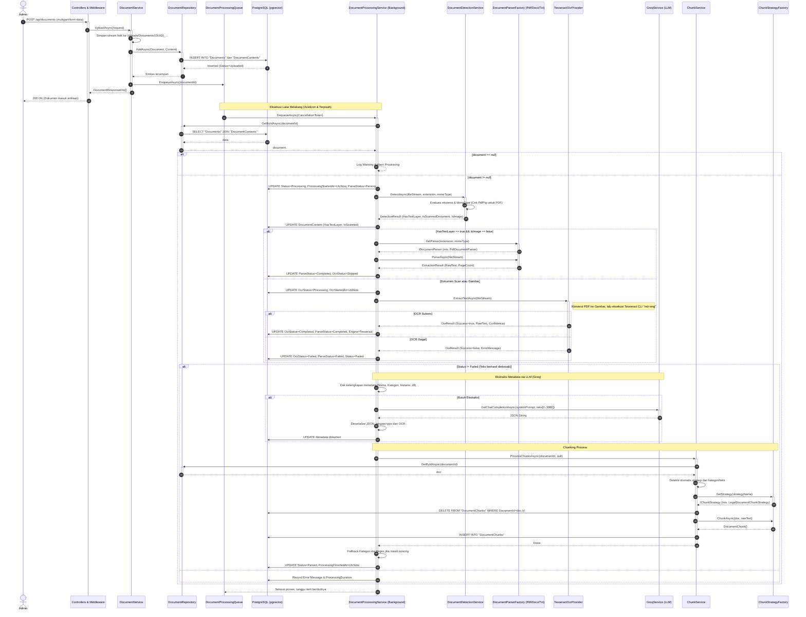

# Kumpulan Diagram Arsitektur Mendalam SIAP
Dokumen ini berisi visualisasi mendalam (Sequence, Activity, Flowchart) dengan tingkat kerumitan tinggi sesuai dengan logika sistem SIAP (Sistem Informasi Analisis Peraturan), memetakan interaksi, penanganan error, percabangan logika, hingga proses AI.

## 1. Sequence Diagram: Pipeline Pemrosesan Dokumen Lanjutan

Sequence diagram ini menggambarkan interaksi asinkron dari upload file hingga ekstraksi metadata menggunakan LLM dan pemecahan teks (chunking). Termasuk alur alternatif dan kegagalan.



## 2. Activity Diagram (Swimlane): Interaksi Chat RAG Lengkap

Memvisualisasikan Request dari Klien, pengecekan Autentikasi/Token, pengambilan memori riwayat chat, pencarian Hibrida RRF (Reciprocal Rank Fusion), sampai generasi jawaban akhir dari AI.

```mermaid
swimlane
    title Activity Diagram RAG Pipeline (Reciprocal Rank Fusion & LLM)
    
    actor "User (Client)" as Client
    participant "API Gateway & Middleware" as Gateway
    participant "ChatController" as Ctrl
    participant "GroqService & OpenAI Service" as AI
    participant "DocumentRepository" as Repo
    participant "PostgreSQL & pgvector" as DB

    Client->Gateway: POST /api/chat { message, sessionId? }
    activate Gateway
    Gateway->Gateway: Validasi JWT Token (Bearer)
    alt Token Tidak Valid
        Gateway-->Client: 401 Unauthorized
    else Token Valid
        Gateway->Ctrl: Teruskan Request ke Controller
        activate Ctrl
        
        Ctrl->DB: Ambil Profil User (Berdasarkan Claims)
        activate DB
        DB-->Ctrl: User Data
        deactivate DB

        alt sessionId disediakan
            Ctrl->DB: SELECT ChatSession & Messages (History)
            activate DB
            DB-->Ctrl: Session History
            deactivate DB
        else sessionId == null
            Ctrl->DB: INSERT ChatSession Baru
            activate DB
            DB-->Ctrl: New Session
            deactivate DB
        end

        alt Ada Riwayat Chat
            Ctrl->AI: [Query Rewriting] Ambil 10 pesan terakhir + message baru
            activate AI
            AI-->Ctrl: Diekstrak menjadi 3-5 kata kunci (FTS Optimized)
            deactivate AI
        else Tidak Ada Riwayat
            Ctrl->Ctrl: Gunakan message asli sebagai SearchQuery
        end

        Ctrl->AI: [Embedding] GenerateEmbeddingAsync(SearchQuery)
        activate AI
        AI-->Ctrl: Vector 1536 Dimensi (OpenAI)
        deactivate AI

        Ctrl->Repo: SearchHybridAsync(SearchQuery, Vector, TopK)
        activate Repo
        
        Repo->DB: [Vector Search] ORDER BY CosineDistance LIMIT TopK*3
        activate DB
        DB-->Repo: VectorResults[]
        deactivate DB
        
        Repo->DB: [FTS Search] ts_vector AND query LIMIT TopK*3
        activate DB
        DB-->Repo: FTSResults[] (Fallback ke OR jika 0)
        deactivate DB
        
        Repo->Repo: [RRF Algorithm] Hitung score = 1 / (60 + rank) untuk tiap array
        Repo->Repo: Gabungkan, urutkan descending, ambil TopK
        Repo-->Ctrl: Chunks Terpilih
        deactivate Repo

        Ctrl->Ctrl: Susun Context dari Chunks (DocumentTitle, ChunkType, Text)
        Ctrl->Ctrl: Rangkai SystemPrompt untuk Anti-Halusinasi
        Ctrl->DB: INSERT ChatMessage (role=user)
        
        Ctrl->AI: [Generation] GetChatCompletionWithHistoryAsync(Prompt, History)
        activate AI
        alt Rate Limit / API Error
            AI-->Ctrl: Throw Exception / Error Message
            Ctrl-->Gateway: 400 Bad Request
            Gateway-->Client: "Rate Limit Exceeded"
        else Berhasil
            AI-->Ctrl: Teks Jawaban (Assistant)
            deactivate AI
            
            Ctrl->DB: INSERT ChatMessage (role=assistant)
            Ctrl-->Gateway: 200 OK { SessionId, Answer, Sources }
            Gateway-->Client: Tampilkan Jawaban AI dan Sumber Referensi
        end
        deactivate Ctrl
    end
    deactivate Gateway
```

*Note: Diagram di atas menggunakan sintaks yang kompatibel dengan alur sequence di Mermaid, karena rendering spesifik `swimlane` asli tidak disupport penuh secara default tanpa library khusus, flow telah dioptimalkan agar serupa dengan Activity.*

## 3. Flowchart: Algoritma Pencarian Hybrid (Reciprocal Rank Fusion)

Penjabaran teknis dari fungsi `SearchHybridAsync` yang berada pada repositori, menyoroti kombinasi vektor dan full-text.

```mermaid
flowchart TD
    START([Mulai: SearchHybridAsync]) --> VARS[Input: keyword, embedding (Vector), topK]
    VARS --> MULTI[Set fetchCount = topK x 3]
    MULTI --> PARALLEL_START{Mulai Pencarian Paralel}

    PARALLEL_START --> VECTOR_SEARCH
    PARALLEL_START --> FTS_SEARCH

    subgraph Vector_Pipeline ["1. Pencarian Semantik (Vector)"]
        VECTOR_SEARCH[Kueri pgvector: ORDER BY CosineDistance] --> LIMIT_V[LIMIT fetchCount]
        LIMIT_V --> RESULT_V(vectorResults)
    end

    subgraph FTS_Pipeline ["2. Pencarian Full-Text (FTS)"]
        FTS_SEARCH[Hapus Stop Words & Susun Kueri] --> Q_AND[Coba Kueri AND (ts_query)]
        Q_AND --> EXEC_AND[Eksekusi Kueri AND]
        EXEC_AND --> CHECK_AND{Ada Hasil?}
        
        CHECK_AND -->|Ya| RESULT_FTS(ftsResults)
        CHECK_AND -->|Tidak| Q_OR[Fallback ke Kueri OR]
        Q_OR --> EXEC_OR[Eksekusi Kueri OR]
        EXEC_OR --> RESULT_FTS
    end

    RESULT_V --> RRF_START
    RESULT_FTS --> RRF_START

    subgraph RRF_Pipeline ["3. Reciprocal Rank Fusion (k=60)"]
        RRF_START[Inisialisasi Dictionary 'rrfScores'] --> LOOP_V[Iterasi vectorResults]
        LOOP_V --> CALC_V[rrfScores[chunk.Id] += 1 / (60 + rank_v)]
        
        CALC_V --> LOOP_FTS[Iterasi ftsResults]
        LOOP_FTS --> CALC_FTS[rrfScores[chunk.Id] += 1 / (60 + rank_fts)]
        
        CALC_FTS --> MERGE[Gabung dan Deduplikasi Chunk (Berdasarkan Id)]
        MERGE --> SORT[Urutkan rrfScores secara Descending]
    end

    SORT --> FINAL_LIMIT[Take(topK)]
    FINAL_LIMIT --> END([Selesai: Kembalikan List DocumentChunk])
```

## 4. Flowchart: Pipeline Chunking Berdasarkan Strategi (Strategy Pattern)

Logika mendalam pemecahan teks menjadi potongan-potongan kecil beserta embeddingnya.

```mermaid
flowchart TD
    START([Mulai Chunking Process]) --> INIT[Input: documentId, strategyName]
    INIT --> GETDOC[Ambil Dokumen dari Database]
    GETDOC --> CHECKTEXT{RawText == null / Kosong?}
    CHECKTEXT -->|Ya| ERROR([Exception: No Text to Chunk])
    CHECKTEXT -->|Tidak| DETECT_STRATEGY{strategyName disuplai?}
    
    DETECT_STRATEGY -->|Ya| FACTORY
    DETECT_STRATEGY -->|Tidak| AUTO_EVAL{Teks / Jenis indikasi Peraturan Hukum?}
    
    AUTO_EVAL -->|Ya (UU, Perda, dll)| SET_LEGAL[strategyName = "Legal"]
    AUTO_EVAL -->|Tidak| SET_PARA[strategyName = "Paragraph"]
    
    SET_LEGAL --> FACTORY
    SET_PARA --> FACTORY
    
    FACTORY[ChunkStrategyFactory.GetStrategy(strategyName)] --> CLEAR[DELETE Semua Chunk Lama untuk DocumentId ini]
    
    CLEAR --> EXECUTE[Eksekusi strategy.ChunkAsync()]
    EXECUTE --> STRATEGY_TYPE{Strategi Terpilih}

    STRATEGY_TYPE -->|Legal| STR_LEGAL[Split Regex: BAB, PASAL, AYAT. Tangkap metadata struktural]
    STRATEGY_TYPE -->|Paragraph| STR_PARA[Split per baris kosong. Terapkan Overlap karakter]
    STRATEGY_TYPE -->|Heading| STR_HEAD[Split pada heading markdown / UPPERCASE block]
    STRATEGY_TYPE -->|Token| STR_TOKEN[Split berdasarkan estimasi maxTokens]

    STR_LEGAL --> VALIDATE_CHUNK
    STR_PARA --> VALIDATE_CHUNK
    STR_HEAD --> VALIDATE_CHUNK
    STR_TOKEN --> VALIDATE_CHUNK

    VALIDATE_CHUNK{Ada Chunk yang dihasilkan?}
    VALIDATE_CHUNK -->|Tidak| ERROR2([Exception: Chunk array is empty])
    VALIDATE_CHUNK -->|Ya| BUILD_CHUNK[Buat Entitas DocumentChunk (Kalkulasi Kata, Offset, Serialisasi Metadata ke JSONB)]
    
    BUILD_CHUNK --> SAVE[Simpan ke PostgreSQL]
    SAVE --> END([Berhasil: Chunks Disimpan])
```

---
*Generated by Agentic Assistant based on SIAP System Architecture & `.NET 10` Source Code Implementation.*
