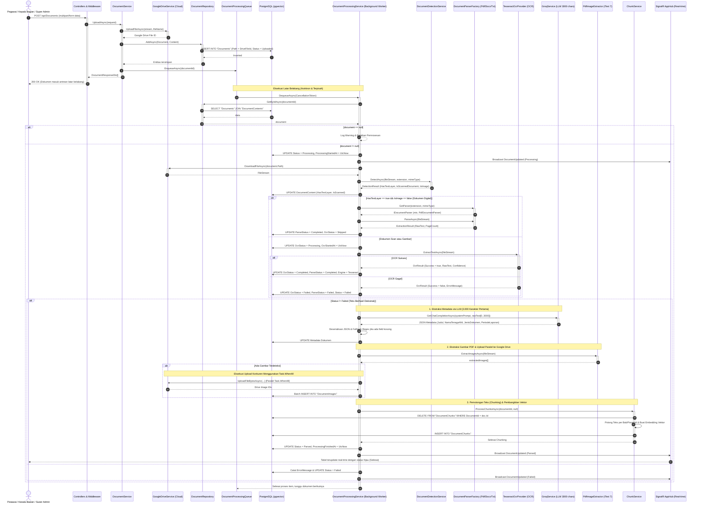
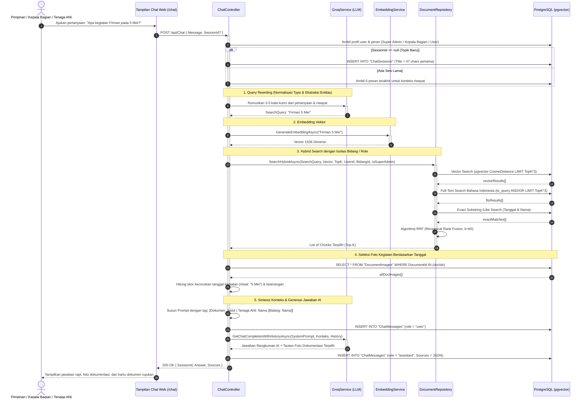
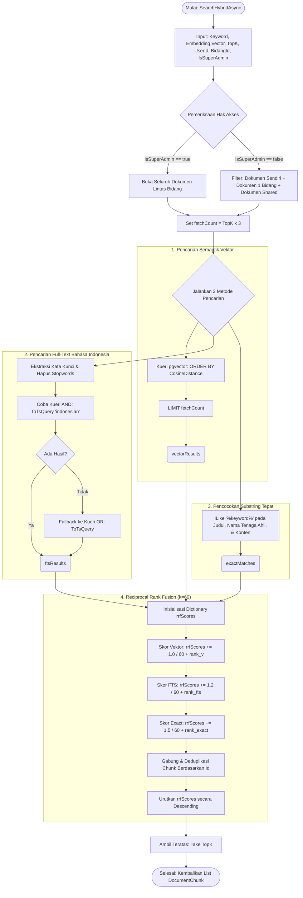

# Kumpulan Diagram Arsitektur Mendalam SIAP / SIPENTA

Dokumen ini berisi visualisasi teknis mendalam (*Sequence, Activity, Flowchart, Component*) sesuai dengan implementasi kode terbaru pada sistem **SIAP / SIPENTA** (*.NET 10 & Next.js*), memetakan interaksi, penanganan kegagalan, percabangan logika, hingga proses AI dan Google Drive.

---

## 1. Sequence Diagram: Pipeline Pemrosesan Dokumen Lanjutan

Sequence diagram ini menggambarkan interaksi asinkron dari pengunggahan berkas, penyimpanan Google Drive, ekstraksi teks & OCR, ekstraksi metadata LLM 3.000 karakter, ekstraksi gambar paralel (`Task.WhenAll`), hingga pemecahan teks (*chunking*).



---

## 2. Sequence Diagram: Pipeline Tanya Jawab RAG & Asisten AI

Memvisualisasikan alur Request dari Klien, verifikasi Token JWT, pemeriksaan Hak Akses Bidang/Super Admin, perumusan kata kunci cerdas (Groq LLM), pencarian Hibrida RRF (Reciprocal Rank Fusion), seleksi foto kegiatan bertanggal, hingga sintesis jawaban akhir.



---

## 3. Flowchart: Algoritma Pencarian Hybrid (Reciprocal Rank Fusion)

Penjabaran teknis dari fungsi `SearchHybridAsync` yang berada pada repositori, menggabungkan pencarian semantik vektor, *Full-Text Search* bahasa Indonesia, dan pencocokan teks langsung:



---

## 4. Flowchart: Pipeline Chunking Berdasarkan Strategi (Strategy Pattern)

Logika pemecahan teks laporan menjadi potongan-potongan kecil terstruktur sebelum disimpan ke database vektor:

```mermaid
flowchart TD
    START([Mulai Chunking Process]) --> INIT[Input: documentId, strategyName]
    INIT --> GETDOC[Ambil Dokumen dari Database]
    GETDOC --> CHECKTEXT{RawText Kosong?}
    CHECKTEXT -- "Ya" --> ERROR([Exception: Tidak ada teks untuk dipotong])
    CHECKTEXT -- "Tidak" --> DETECT_STRATEGY{strategyName Disuplai?}
    
    DETECT_STRATEGY -- "Ya" --> FACTORY
    DETECT_STRATEGY -- "Tidak" --> AUTO_EVAL{Jenis Dokumen Berupa Peraturan Hukum?}
    
    AUTO_EVAL -- "Ya (Perda / SK)" --> SET_LEGAL[strategyName = 'Legal']
    AUTO_EVAL -- "Tidak (Laporan Kerja Bulanan)" --> SET_PARA[strategyName = 'Paragraph']
    
    SET_LEGAL --> FACTORY
    SET_PARA --> FACTORY
    
    FACTORY[ChunkStrategyFactory.GetStrategy(strategyName)] --> CLEAR[DELETE Semua Chunk Lama untuk Dokumen ini]
    CLEAR --> EXECUTE[Eksekusi strategy.ChunkAsync]
    EXECUTE --> STRATEGY_TYPE{Strategi Terpilih}

    STRATEGY_TYPE -- "Legal" --> STR_LEGAL[Pemisahan Regex: BAB, PASAL, AYAT]
    STRATEGY_TYPE -- "Paragraph" --> STR_PARA[Pemisahan Baris Kosong + Overlap Karakter]
    STRATEGY_TYPE -- "Heading" --> STR_HEAD[Pemisahan pada Heading Markdown]
    STRATEGY_TYPE -- "Token" --> STR_TOKEN[Pemisahan Berdasarkan Estimasi maxTokens]

    STR_LEGAL & STR_PARA & STR_HEAD & STR_TOKEN --> VALIDATE_CHUNK{Ada Chunk Dihasilkan?}
    VALIDATE_CHUNK -- "Tidak" --> ERROR2([Exception: Chunk array kosong])
    VALIDATE_CHUNK -- "Ya" --> BUILD_CHUNK[Bentuk Entitas DocumentChunk: Hitung Kata, Offset, Serialisasi Metadata ke JSONB]
    
    BUILD_CHUNK --> SAVE[Simpan ke PostgreSQL & Bentuk Embedding]
    SAVE --> END([Berhasil: Chunks Disimpan])
```
